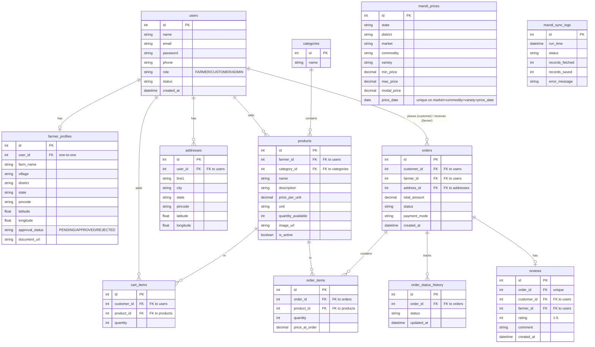

# KisanMandi ER Diagram

## Explanation
- **users**: Stores all users (Farmers, Customers, Admins).
- **farmer_profiles**: Extended details for farmers (linked one-to-one with users).
- **categories**: Product categories (e.g., Vegetables, Fruits).
- **products**: Items listed by farmers.
- **addresses**: Delivery addresses for customers.
- **cart_items**: Shopping cart contents for customers.
- **orders**: Main order record linking customer, farmer, and delivery address.
- **order_items**: Individual products within an order.
- **order_status_history**: Audit trail of status changes for an order.
- **reviews**: Feedback given by customers on completed orders.
- **mandi_prices**: Daily price data fetched from data.gov.in.
- **mandi_sync_logs**: Logs of background jobs fetching mandi prices.

## Order Status Flow
`PLACED` -> `ACCEPTED` -> `PACKED` -> `OUT_FOR_DELIVERY` -> `DELIVERED` (or `REJECTED` / `CANCELLED`)
